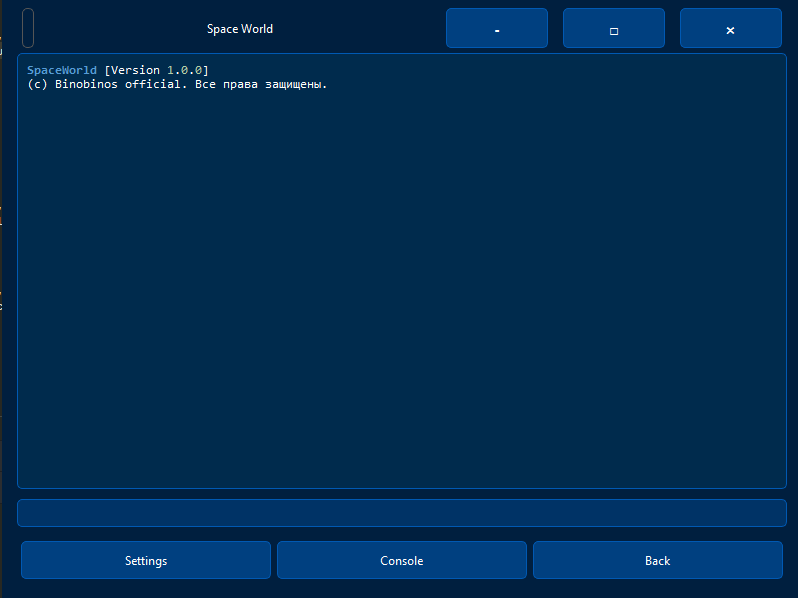
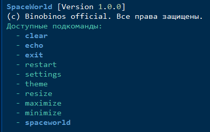
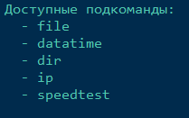

<h1>SpaceWorld - Кастомизируемый интерфейс с консолью</h1>

SpaceWorld - это кастомизируемый графический интерфейс с встроенной консолью, поддерживающей множество команд и тем оформления.

<h2>Особенности</h2>

    

        
🎨

        
<strong>16 готовых тем</strong> оформления (dark, light, cyberpunk, ocean и другие)

    

    

        
🖥️

        
<strong>Встроенная консоль</strong> с подсветкой синтаксиса

    

    

        
📝

        
<strong>История команд</strong> с автодополнением

    

    

        
🖱️

        
<strong>Кастомный заголовок окна</strong> с кнопками управления

    

    

        
⚙️

        
<strong>Настройки интерфейса</strong> (тема, размер окна)

    

    

        
📂

        
<strong>Работа с файлами и директориями</strong> через консоль

    

    

        
⏱️

        
<strong>Команды даты и времени</strong>

    

    

        
🌐

        
<strong>Проверка скорости интернета</strong> и IP-адресов

    

<h2>Установка</h2>

<ol>
    <li>Убедитесь, что у вас установлен Python 3.8+</li>
    <li>Установите зависимости:
        <pre><code>pip install -r requirements.txt</code></pre>
    </li>
</ol>

<h2>Запуск</h2>

<pre><code>python main.py</code></pre>

<h2>Использование</h2>

<h3>Основные команды консоли</h3>

<ul>
    <li><code>help</code> - Показать справку</li>
    <li><code>clear</code> - Очистить консоль</li>
    <li><code>echo [текст]</code> - Вывести текст</li>
    <li><code>exit</code> - Выйти из приложения</li>
    <li><code>restart</code> - Перезапустить приложение</li>
    <li><code>settings</code> - Открыть настройки</li>
    <li><code>theme [название]</code> - Изменить тему (например: <code>theme dark</code>)</li>
    <li><code>resize [ширина] [высота]</code> - Изменить размер окна</li>
    <li><code>maximize</code> - Развернуть окно</li>
    <li><code>minimize</code> - Свернуть окно</li>
</ul>

<h3>Команды SpaceWorld</h3>

<ul>
    <li><code>spaceworld version</code> - Показать версию</li>
    <li><code>spaceworld datatime [time/date/week/year]</code> - Информация о дате/времени</li>
    <li><code>spaceworld file [create/read/write/delete]</code> - Работа с файлами</li>
    <li><code>spaceworld dir [create/delete]</code> - Работа с директориями</li>
    <li><code>spaceworld speedtest</code> - Проверить скорость интернета</li>
    <li><code>spaceworld ip</code> - Показать IP-адреса</li>
    <li><code>spaceworld random [начало] [конец]</code> - Случайное число в диапазоне</li>
</ul>

<h2>Структура проекта</h2>

    <pre>.
├── config/                  # Конфигурационные файлы
│   ├── config.json          # Основной конфиг
│   └── config.py            # Загрузка/сохранение конфига
├── console/                 
│   └── Console.py           # Логика консоли
├── CustomTitleBar.py        # Кастомная панель заголовка
├── MainWindow.py            # Главное окно приложения
├── SettingsDialog.py        # Диалог настроек
├── main.py                  # Точка входа
├── requirements.txt         # Зависимости
└── README.md                # Этот файл</pre>

<h2>Лицензия MIT</h2>

© Binobinos official. Все права защищены.

